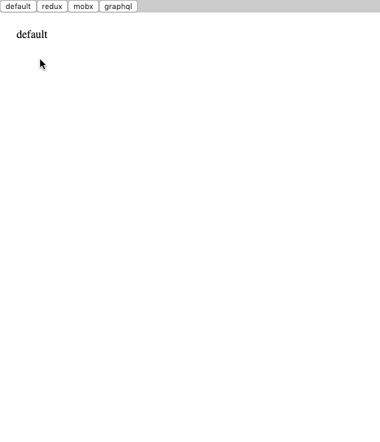

# React State Management Sandbox

## Overview
This is a simple sandbox to compare different state management strategies for building a
React web application. The server exposes two strategies: RESTful JSON API and GraphQL via
Apollo Server. The client implements three strategies: Redux, MobX, and GraphQL via Apollo
Client. To start the server first `npm install`, then `npm run webpack:production`, and
then `node index.js`. To view the client applications visit
[http://localhost:3000/dist](http://localhost:3000/dist).

## By The Numbers
|                       | Webpack Bundle Size (kilobytes) 1 | Time To Bundle (milliseconds) | Unbundled User Code Size (bytes) | Unbundled User Lines Of Code 2 |
| --------------------- | -------------------------------------------- | ----------------------------- | -------------------------------- | ----------------------------------------- |
| Baseline 3 | 119                                          | 3229                          | 3393                             | 99                                        |
| Redux 4    | 151                                          | 3935                          | 16287                            | 471                                       |
| MobX 5     | 190                                          | 4235                          | 10501                            | 312                                       |
| GraphQL 6  | 304                                          | 5546                          | 11102                            | 326                                       |

1 [Webpack 4.30.0](https://github.com/webpack/webpack) on [jordanpatton/react-state-management-sandbox](https://github.com/jordanpatton/react-state-management-sandbox).
2 Calculated lines of code with find `./path/to/files -type f | xargs wc -l`.
3 Includes [prop-types@15.7.2](https://github.com/facebook/prop-types), [react@16.8.6](https://github.com/facebook/react), [react-dom@16.8.6](https://github.com/facebook/react/tree/master/packages/react-dom).
4 Includes Baseline and [react-redux@7.0.2](https://github.com/reduxjs/react-redux), [redux@4.0.1](https://github.com/reduxjs/redux), [redux-thunk@2.3.0](https://github.com/reduxjs/redux-thunk).
5 Includes Baseline and [mobx@5.9.4](https://github.com/mobxjs/mobx), [mobx-react@5.4.3](https://github.com/mobxjs/mobx-react).
6 Includes Baseline and [apollo-boost@0.3.1](https://github.com/apollographql/apollo-client/tree/master/packages/apollo-boost), [graphql@14.2.1](https://github.com/graphql/graphql-js), [react-apollo@2.5.4](https://github.com/apollographql/react-apollo).

## Screencast

## Useful Links
- General
  - https://www.valentinog.com/blog/react-webpack-babel/
  - https://meyerweb.com/eric/tools/css/reset/
- Redux
  - https://redux.js.org/introduction/getting-started
- MobX
  - https://mobx.js.org/best/decorators.html
  - https://mobx.js.org/refguide/array.html
  - https://github.com/mobxjs/mobx-react
  - https://mobx.js.org/best/actions.html
- GraphQL
  - https://www.youtube.com/watch?v=ed8SzALpx1Q
  - https://github.com/iamshaunjp/graphql-playlist/blob/lesson-36/server/schema/schema.js
  - Apollo Server
    - https://www.apollographql.com/docs/apollo-server/essentials/server
    - https://www.apollographql.com/docs/apollo-server/essentials/data
    - https://github.com/apollographql/apollo-server-tutorial/tree/master/data
  - Apollo Client
    - https://www.apollographql.com/docs/react/
    - https://reactjs.org/docs/render-props.html
    - https://reactjs.org/docs/context.html
      - https://github.com/facebook/react/issues/13969 (put context in a separate file)
    - https://www.apollographql.com/docs/react/api/react-apollo#graphql-config-options-fetchPolicy
    - https://spectrum.chat/apollo/general/cant-get-simple-client-only-route-data-sample-working~23502776-f025-46a4-a311-27c45bb7402a
